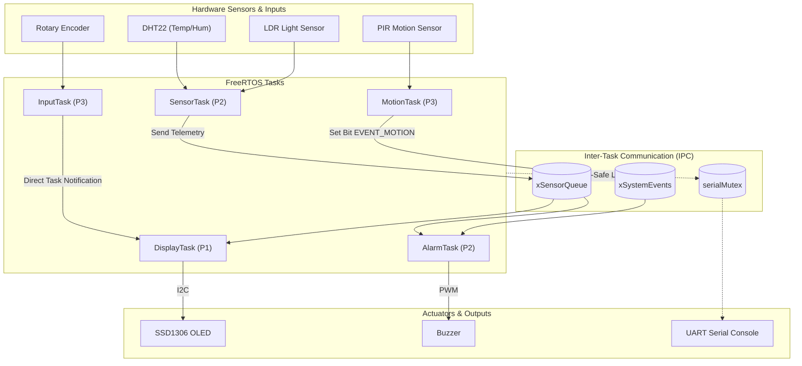
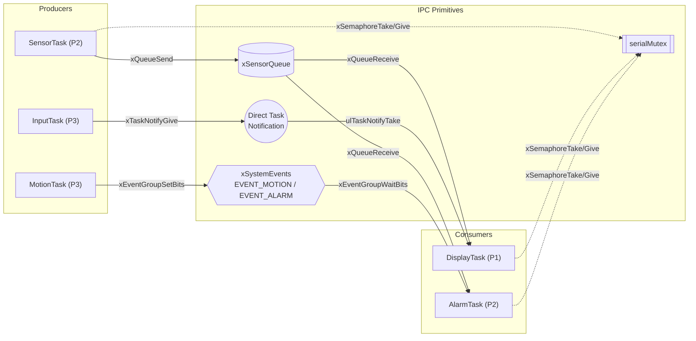
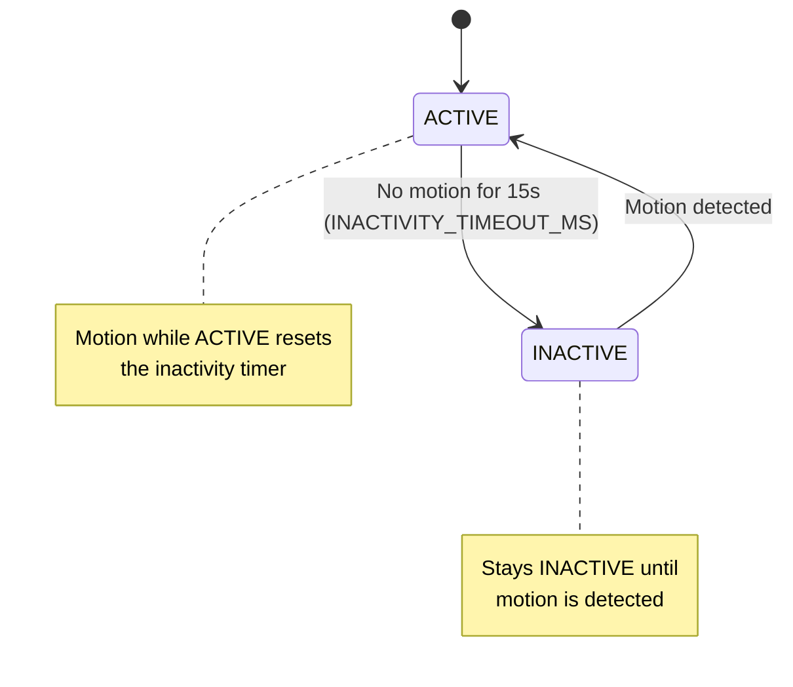

# Real-Time Multisensor Room Monitoring System

BCA152 Microcontrollers – Laboratory Activity No. 1
Mindanao State University – Iligan Institute of Technology
BS Computer Applications

## Project Overview

This project is an ESP32-based real-time multisensor room monitoring system built with **PlatformIO**, **ESP-IDF**, and **native FreeRTOS APIs**, simulated in **Wokwi**. The system continuously samples temperature, humidity, ambient light, and motion, drives an OLED display navigable via a rotary encoder, and triggers a buzzer alarm on out-of-range temperature readings. No Arduino framework or libraries are used anywhere in the project.

## Features

- Temperature measurement using DHT22
- Humidity measurement using DHT22
- Relative ambient-light measurement using LDR
- PIR motion detection
- OLED display (SSD1306, I2C)
- Rotary encoder navigation between display modes
- Temperature alarm using buzzer (low/high threshold)
- ACTIVE and INACTIVE system states based on motion and inactivity timeout

## Learning Objectives

The project demonstrates practical use of:

- PlatformIO with the ESP-IDF framework
- Native FreeRTOS APIs (tasks, queues, mutex, event groups, task notifications)
- Periodic task execution with `vTaskDelayUntil`
- A simple finite state machine (ACTIVE / INACTIVE)
- Inter-task communication without shared-state race conditions

## Required README Visuals

> Screenshots below are referenced from the `docs/` folder. Capture each one from the running Wokwi simulation and PlatformIO, save it under `docs/` with the filename shown, and it will render automatically here.

### 1. Wokwi Circuit


*Full wiring of the ESP32 with the DHT22, LDR, PIR, rotary encoder, SSD1306 OLED, and buzzer, as simulated in Wokwi.*

### 2. System Architecture Diagram



*High-level view of how sensor inputs, FreeRTOS tasks, IPC primitives, and actuators fit together.*

### 3. FreeRTOS Task-Communication Diagram



*Which FreeRTOS primitive carries which data between which tasks: the queue for sensor telemetry, the event group for motion/alarm signaling, direct task notification for encoder-driven display updates, and the mutex guarding shared serial output.*

### 4. State-Machine Diagram



*ACTIVE/INACTIVE system state machine: any motion event returns the system to ACTIVE, and the system falls back to INACTIVE after 15 seconds without motion.*

### 5. Finished System Screenshot

(NOT DONE YET)

*The complete simulation running in Wokwi with live sensor readings on the OLED and the serial console showing startup and telemetry logs.*

## FreeRTOS Task Architecture

| Task | Priority | Responsibility |
|---|---:|---|
| SensorTask | 2 | DHT22 and LDR measurements every 2 s |
| DisplayTask | 1 | OLED ownership and selected measurement |
| InputTask | 3 | Rotary encoder navigation |
| MotionTask | 3 | PIR activity and ACTIVE/INACTIVE state |
| AlarmTask | 2 | Temperature alarm and buzzer |

## Hardware / Simulated Components

- ESP32 (DOIT ESP32 DevKit V1)
- DHT22 temperature/humidity sensor
- Photoresistor / LDR
- PIR motion sensor
- Rotary encoder (KY-040)
- SSD1306 OLED (I2C)
- Buzzer

## Pin Configuration

| Component | ESP32 |
|---|---|
| DHT22 | GPIO16 |
| LDR analog output | GPIO34 / ADC1_CH6 |
| PIR | GPIO27 |
| Encoder A (CLK) | GPIO25 |
| Encoder B (DT) | GPIO26 |
| Encoder switch (SW) | GPIO33 |
| OLED SDA | GPIO21 |
| OLED SCL | GPIO22 |
| Buzzer | GPIO32 |

## Inter-Task Communication

- **Queue (`xSensorQueue`)** — carries sensor telemetry (temperature, humidity, light, motion snapshot) from `SensorTask` to `DisplayTask` and `AlarmTask`.
- **Event Group (`xSystemEvents`)** — signals `EVENT_MOTION` (set by `MotionTask`) and `EVENT_ALARM` (set/cleared by `AlarmTask`) for state-dependent behavior.
- **Direct Task Notification** — `InputTask` notifies `DisplayTask` directly on encoder activity, avoiding an extra queue for a single producer/consumer pair.
- **Mutex (`serialMutex`)** — protects shared UART/serial output so log lines from different tasks are not interleaved.

## State Machine

The system supports **ACTIVE** and **INACTIVE** states:

- Motion returns the system to `ACTIVE`.
- The system enters `INACTIVE` after 15 seconds (`INACTIVITY_TIMEOUT_MS`) without motion.

## Temperature Alarm Thresholds

| Condition | Threshold | Alarm State |
|---|---|---|
| Below | 18.0 °C | `LOW_TEMPERATURE` |
| 18.0 °C – 30.0 °C | — | `NORMAL` |
| Above | 30.0 °C | `HIGH_TEMPERATURE` |

## Repository Structure

```text
bca152-freertos-multisensor/
├── .vscode/
├── docs/
├── include/
│   ├── alarm.h
│   ├── config.h
│   ├── display.h
│   ├── input.h
│   ├── motion.h
│   ├── rtos_objects.h
│   ├── sensors.h
│   ├── system_state.h
│   └── system_tasks.h
├── lib/
├── src/
│   ├── alarm.cpp
│   ├── CMakeLists.txt
│   ├── display.cpp
│   ├── input.cpp
│   ├── main.cpp
│   ├── motion.cpp
│   ├── rtos_objects.cpp
│   ├── sensors.cpp
│   ├── system_state.cpp
│   └── system_tasks.cpp
├── test/
│   └── test_logic/
│       └── test_logic.cpp
├── CMakeLists.txt
├── diagram.json
├── platformio.ini
├── README.md
├── sdkconfig.esp32doit-devkit-v1
└── wokwi.toml
```

## Getting Started

1. Install [PlatformIO](https://platformio.org/) and the [Wokwi for VS Code](https://marketplace.visualstudio.com/items?itemName=wokwi.wokwi-vscode) extension.
2. Open this folder in VS Code.
3. Build the firmware (see below).
4. Run the Wokwi simulation via `F1` → `Wokwi: Start Simulator`.

## Building the Project

```bash
pio run
```

## Running Unit Tests

The project contains the required 13 deterministic unit tests, split across a native test environment (no hardware/simulation required):

```bash
pio test -e native
```

Coverage:

- 5 alarm tests (`evaluateTemperature`)
- 4 display navigation tests (`nextDisplayMode` / `previousDisplayMode`)
- 4 system-state tests (`evaluateSystemState`)

## Static Code Analysis

```bash
pio check
```

## Functional Verification

Functional tests FT-01 through FT-10 are executed manually against the running Wokwi simulation (separate from the automated unit tests above). Record the actual observed results for each in the laboratory report.

| Test ID | Scenario | Expected Result | Observed Result |
|---|---|---|---|
| FT-01 | | | |
| FT-02 | | | |
| FT-03 | | | |
| FT-04 | | | |
| FT-05 | | | |
| FT-06 | | | |
| FT-07 | | | |
| FT-08 | | | |
| FT-09 | | | |
| FT-10 | | | |

## Engineering Decisions

- Implementation strictly follows the required ESP-IDF and native FreeRTOS architecture; no Arduino framework or Arduino-style libraries are used.
- OLED communication uses the current ESP-IDF I2C master driver (`driver/i2c_master.h`), not the legacy `driver/i2c.h` API.
- Unit tests run under a native PlatformIO environment rather than on-target, so `evaluateTemperature`, `nextDisplayMode`/`previousDisplayMode`, and `evaluateSystemState` are exercised as pure functions decoupled from FreeRTOS/hardware calls.

## Limitations

The relative light value is represented as 0–100% from the ADC reading. It is not presented as calibrated lux.

## Future Improvements

None are required for the laboratory implementation.

## References and Acknowledgments

Laboratory Activity No. 1, BCA152 Microcontrollers, Mindanao State University – Iligan Institute of Technology.
